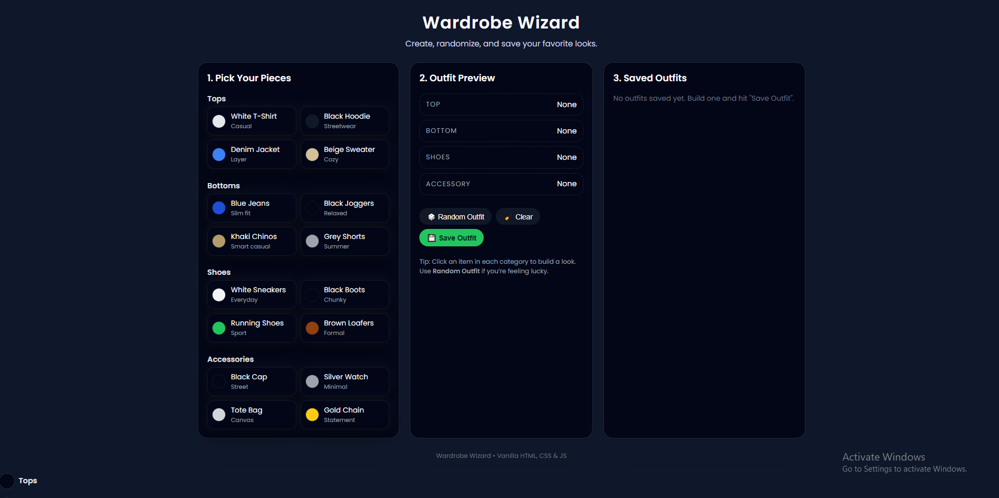
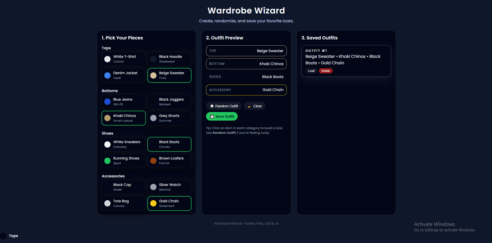

# Wardrobe Wizard 👗✨

Wardrobe Wizard is a web-based outfit planning application that allows users to mix, match, randomize, and save outfit combinations from their wardrobe. This project was completed as a collaborative front-end development assignment using HTML, CSS, and JavaScript.

🌐 **Live Application:**  
https://alexiaboylen.github.io/Wardrobe-Wizard/

##Presentation
[](https://www.youtube.com/watch?v=<ARLZV6xk4Ss>)

---

## 🎯 Project Purpose

The purpose of Wardrobe Wizard is to help users easily create outfit combinations in a fun and interactive way. From an academic perspective, this project demonstrates core front-end development skills such as DOM manipulation, event handling, GitHub collaboration, and project organization.

---

## ✨ Main Features

- Select clothing items from multiple wardrobe categories
- Preview a complete outfit
- Generate random outfit combinations
- Save favorite outfits
- Clear selections and start over

---

## 🖼️ Screenshots of Live Application

### Outfit Builder


### Saved Outfits


---

## ▶️ Demo Video

🎥 **Project Demo Video:**  
[PASTE DEMO VIDEO LINK HERE]

---

## 🛠 Installation & Running the Project

### Requirements
- A modern web browser
- No external libraries or frameworks required

### Steps to Run Locally

1. Clone the repository:
   ```bash
   git clone https://github.com/AlexiaBoylen/Wardrobe-Wizard.git

## 📦 Dependencies

- HTML
- CSS
- Vanilla JavaScript  
*(No external dependencies)*

---

## 👥 Team Members, Roles & Contributions

| Team Member | Role | Contributions |
|------------|------|---------------|
| **Alexia Boylen** | Project Lead & Integration Developer | Created the project structure, implemented core JavaScript logic, random outfit generator, save functionality, and managed deployment |
| **Andrew Doyle** | JavaScript Feature Developer | Developed and improved JavaScript features, debugging, and collaborated using a feature branch |
| **Angel Ysmael** | UI/UX & Styling Developer | Designed and implemented CSS styling, improved layout, and enhanced visual usability |
| **Vivian Onyejiaka** | Layout, Assets & Testing | Assisted with HTML layout, asset organization, usability testing, and feature validation |

---

## 🌿 GitHub Workflow & Project Resources

- **GitHub Repository:**  
  https://github.com/AlexiaBoylen/Wardrobe-Wizard

- **Branches:**  
  - `main`  
  - `andrew-js`

- **Pull Requests:**  
  - PR #13 – Feature branch merged into main

- **Issue Board:**  
  https://github.com/AlexiaBoylen/Wardrobe-Wizard/issues

- **Commit History:**  
  https://github.com/AlexiaBoylen/Wardrobe-Wizard/commits/main

---

## 📄 Project Documentation & Resources

- README.md
- Demo Video
- GitHub Issues & Pull Requests
- Commit History
- Live Deployed Application

---

## 🚀 Future Improvements

- User-uploaded clothing images
- Improved mobile responsiveness
- Outfit filtering by style or color
- Persistent saved outfits across sessions
